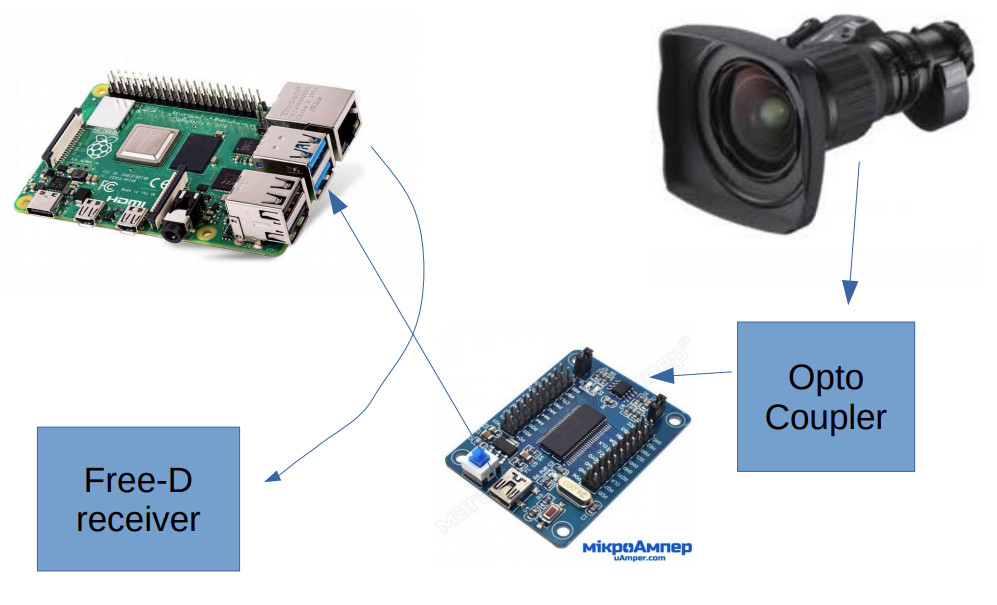

# EZ-USB (CY7C68013A EZ-USB FX2LP) based decoder for Canon HJ14ex4.3B IRSE virtual output

Lens **Canon HJ14ex4.3B** has output that can provide information from internal rotary encoder.

# Functional schematic

# Signal direction
* [Cable](HW/Camera_Lens_Cable/) connected to first lens output provides rotary decoder info of Zoom/Focus/Iris
* This data sent to [opto-isolator board](HW/EZ-USB_motherboard/) that bridged with CY7C68013A based logic analizer board
* Logic analizer connected by USB cable mini-pc
* [Software](src/ez-usb/) that perform decoding of raw data received from lens installed on mini pc. After decoding, it compose Free-D packets sent to reciever (render station or [lens calibrarting server](https://github.com/max-verem/VRPN-LensCalibration))

