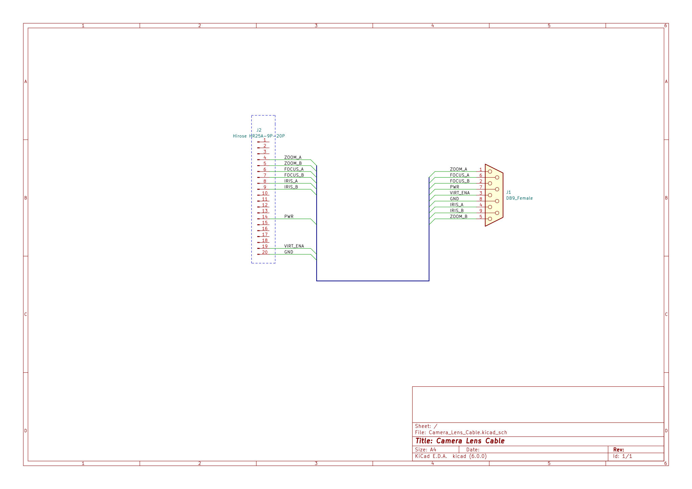

# Hirose 20 Pin Male HR25-9P-20P for Canon HJ14ex4.3B IRSE

## Schematic

## Assembling

You can use separate connector **Hirose HR25A-9P-20P** connector:

and assemble cable:

another way is to buy cable with soldered **Alvin’s Cables Hirose 20 Pin Male HR25-9P-20P to Open End Shield Cable for Canon Fujinon ENG Lens 1M** cable:

that you can buy [here](https://www.aliexpress.com/item/1005001689120693.html) and [here](https://www.amazon.co.uk/Alvins-Cables-Hirose-HR25-9P-20P-Fujinon/dp/B08MC7KPMV)
