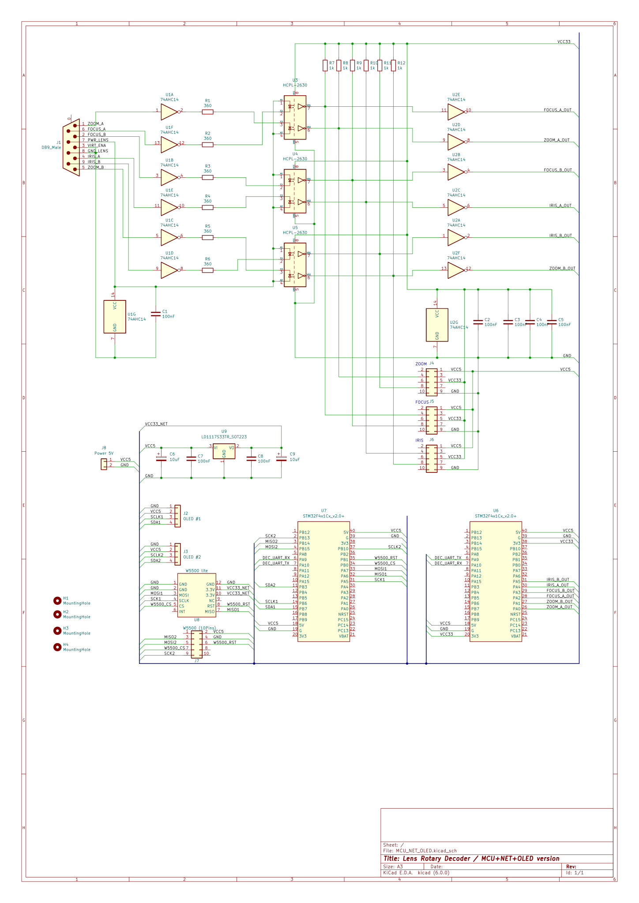
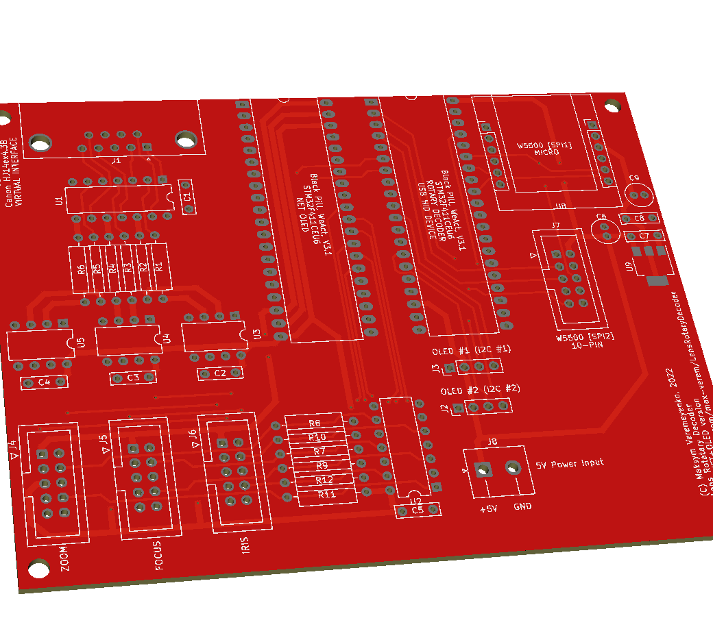

# MCU version of rotary decoder

This version cover both cases:
* Canon HJ14ex4.3B lens virtual output encoder
* Standalone rotary encoders

## Schematic

## PCB

[gerber file](gerber/)

## Firmware

* [rotary decoder firmware source](../STM32/STM32F411CEU6_RotaryDecoder_3X)
* [NET OLED interface](../STM32/STM32F411CEU6_FPGA_UART)

## Hardcoded things

* MAC address of this device is **BA:DE:C0:DE:XX:00** where **XX* is a *unique* hex value for that board
* IP address of FreeD receiver is broadcast (255.255.255.255), destination port is **60000** + **XX**
