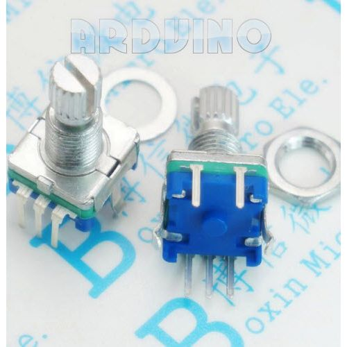
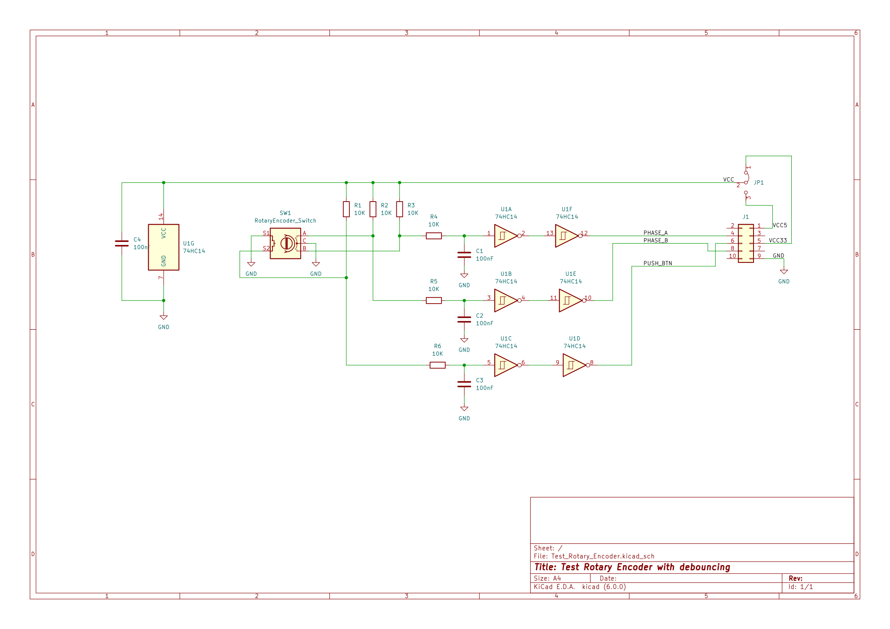
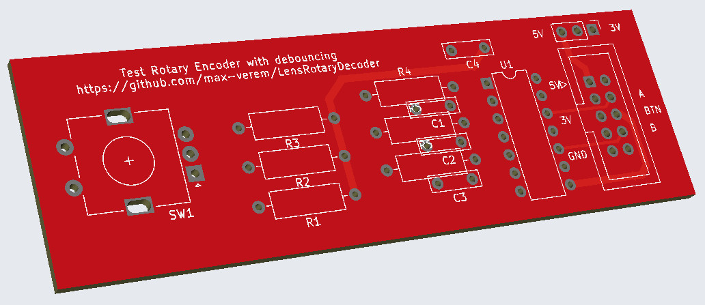

# Test Rotary Encoder

This is a EC11 rotary encoder with debouncing curcuit that is used in this project to debug and simulating purpose.

## Main module

## Schematic

## PCB

gerber [file](gerber/)
