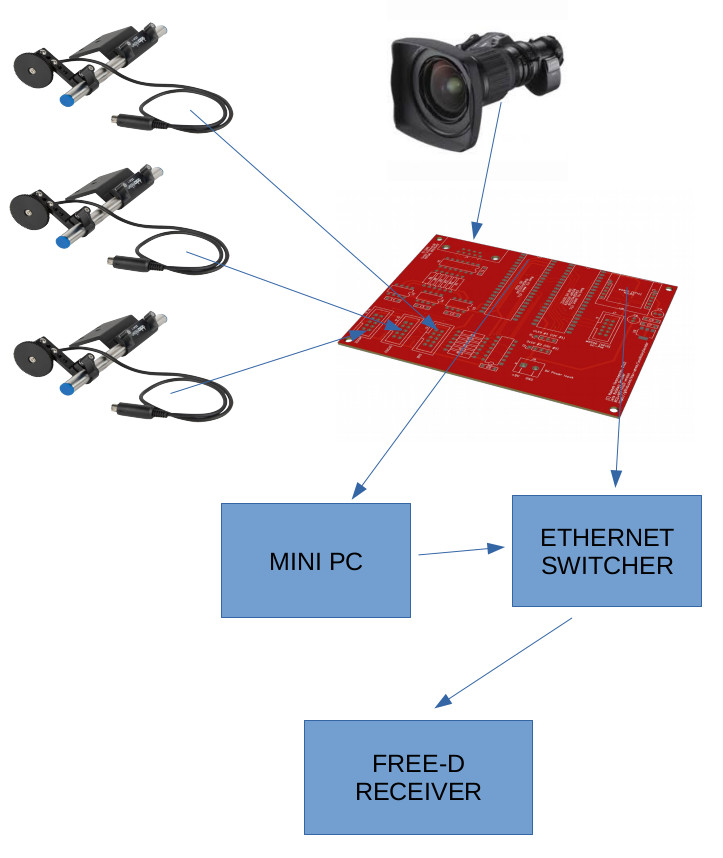
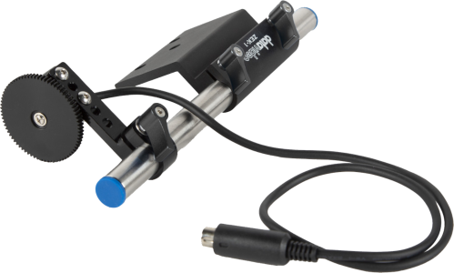
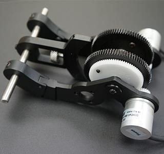
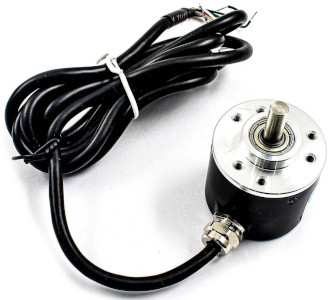

# MCU version of rotary decoder for Canon HJ14ex4.3B IRSE virtual output or standalone rotary encoders

[Previous](EZ-USB.md) version require a lot of CPU power to decode data, so we developing more simplified version that could also cover standalone encoders support

## Functional diagram

## Implementation

[Core board](HW/MCU_NET_OLED/) perform all task for receiving/processing/sending data, it accept [Canon lens cable](HW/Camera_Lens_Cable/) for connecting lens directly.

Standalone encoders:

 

could also be connection to that board (for Zoom/Focus/Iris)

